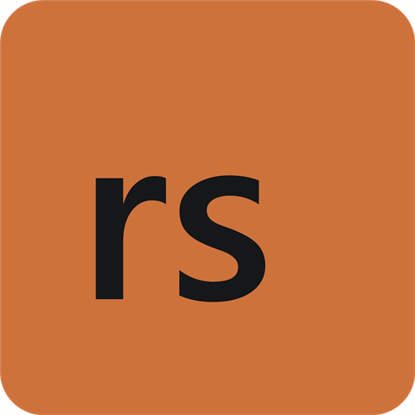

# T7 Patch — Rust Port

[](https://github.com/staFF6773/T7Patch-Rs/actions/workflows/ci.yml)

A Rust desktop launcher and DLL for **64-bit Black Ops III / T7**. The launcher lets you change your player name, network password, and friends-only setting, then detects the game and activates the patch automatically. MinHook remains a native C dependency, accessed through FFI and managed by Cargo.

**Status: experimental.** The Windows UI and loading mechanism have been checked locally, including remote loading into a dedicated test process. Full operation inside BO3 and compatibility with Wine/Proton still require runtime validation.

This is a reimplementation based on the listed source references, not the official Serious DLL. The Scroptss source baseline and the official published ZBR Native sources are different revisions; equivalence to the latest official binary has not been established. User testing identified a UI string-query performance regression (corrected) and a mode-transition crash traced to an incorrect message-reader entry point. The corrected entry was verified in live September2026 code; successful mode transitions with the rebuilt DLL still need confirmation. See [hang diagnostics](docs/VALIDATION.md#mode-transition-hangs).

## Platform support

| Platform | How it runs | Validation status |
| --- | --- | --- |
| Windows 10 or later, x64 | Windows launcher and DLL | Build, UI, and loader checks passed; in-game validation pending |
| Linux / Steam Deck | The same Windows binaries through Wine/Proton | Setup instructions provided; runtime validation pending |

The current build target is `x86_64-pc-windows-msvc`. There is no native Linux executable or `.so` build. The documented build workflow runs on Windows; Linux users can copy its output and use the setup below.

## Windows setup

### Requirements

- Windows 10 or later, 64-bit.
- An installed copy of Black Ops III matching a [recognized game build](#recognized-game-builds).
- `t7patch.exe` and `t7patch.dll` from the same build, kept together in a writable folder.
- The [Microsoft Visual C++ x64 runtime](https://learn.microsoft.com/en-us/cpp/windows/latest-supported-vc-redist), if it is not already installed.

### Run the patch

1. Build the project using [Build from source](#build-from-source), or use a matching pair of compiled binaries.
2. Keep **`dist/t7patch.exe` and `dist/t7patch.dll` in the same folder** and open `t7patch.exe` before starting BO3. The window displays `No game process found.`
3. Set **Player name**, **Network password**, and **Friends only** in the **Settings** tab. Changes are saved automatically; the tab shows pending changes or a save error. Switching tabs retains your edits.
4. Start BO3 normally. The launcher detects `BlackOps3.exe`, loads the DLL, and waits for the game's objects to become available.
5. `Patch active` appears only after the DLL confirms successful installation. The **Game connection** card highlights the active state in green. Click **Details** to read the full status or an error message that does not fit in the window.

The launcher rechecks process identity through its open handle and tracks that handle to avoid confusing a reused PID with the original game process. When the game closes, it waits for the next launch. Opening a second launcher brings the existing window to the foreground.

Closing the launcher leaves an already installed patch active in the game. Reopening it recognizes the loaded DLL. A permanent installation failure or explicit deactivation requires restarting BO3; a game that is still initializing is retried automatically.

The launcher has its own Rust-inspired charcoal and oxide-orange theme. **Settings**, **Updates**, and **Credits** tabs keep the interface compact, with game connection status always visible above them. Use the arrow keys while the tab strip is focused, or **Ctrl+Tab / Ctrl+Shift+Tab** from any tab, to switch sections. Hidden controls are excluded from keyboard navigation, and game detection and updates continue in the background. Native controls support visible focus and system DPI scaling. The header includes minimize and close controls; drag its empty area to move the window. **Credits** acknowledges Serious / shiversoftdev, Scroptss, T7Patch-Rs, and MinHook with links to their projects and references.

## Launcher updates

Starting with **v0.0.1**, the launcher checks the latest stable [GitHub Release](https://github.com/staFF6773/T7Patch-Rs/releases) when opened. **Check for updates** in the **Updates** tab repeats the check manually. Updates come from `staFF6773/T7Patch-Rs` over HTTPS without a GitHub login; a commit or temporary Actions artifact is not an update release.

1. When a newer version is available, click **Download update**. The interface displays download progress while normal game detection continues.
2. The package's sizes, SHA-256 hashes, platform and EXE/DLL structure are checked before installation. Once verified, close BO3 and click **Install & restart**.
3. The launcher saves pending settings, pauses injection, and starts a temporary helper. The helper waits for the launcher to exit, replaces the EXE and DLL together, then restarts the launcher. **`t7patch.conf` is preserved.**

Downloads are staged in the installation directory. A recovery journal and backups let the helper restore the previous pair if a replacement fails; interrupted installations are recovered on the next startup before game detection. Files still in use or an unwritable installation directory produce an error. Recovery keeps its journal/backups if restoration cannot complete. Helper failures are shown in a dialog, and transaction errors are recorded in `t7patch-update.log`.

With no published Releases, the launcher displays **No published update releases yet**. Offline checks and GitHub rate limits leave the installed patch usable. Only stable versions newer than the installed Cargo version are offered. The first version containing the updater must be installed manually. The updater uses Windows APIs; Wine/Proton runtime validation remains pending.

### Publishing an update

1. Set a new stable version in `Cargo.toml` and update `Cargo.lock` with Cargo. Commit and push the changes.
2. Publish a matching tag, for example `v0.0.1` for version `0.0.1`.
3. The **Release** workflow verifies the version, runs checks, builds and tests the Windows binaries, and creates `t7patch-windows-x64.zip` plus `update.json`.
4. It uploads both assets to a draft Release before making it public. Existing public Releases are not overwritten; publish a new version for changes.

The archive contains only `t7patch.exe` and `t7patch.dll`. The schema-1 manifest records the version, `x86_64-pc-windows-msvc` target, archive hash/size and each binary's hash/size. To produce and verify the assets locally after building:

```powershell
powershell.exe -NoProfile -ExecutionPolicy Bypass -File .\scripts\package-release.ps1
cargo run --release --locked --target x86_64-pc-windows-msvc --bin t7patch-launcher -- --verify-update-package target/release-package
```

Output is in `target/release-package`. Creating or pushing a tag and publishing the first Release are separate from implementing the updater.

## Linux / Steam Deck setup

These instructions run the **Windows launcher and DLL through Wine/Proton**. They describe the intended setup; this port has not yet been validated inside BO3 on Linux.

### Steam with Proton

1. Install BO3 in Steam and select a Proton version in the game's **Properties > Compatibility** settings.
2. Launch the game once, then close it, so Steam creates its Proton prefix. BO3's Steam App ID is **`311210`**.
3. Copy the Windows build's `dist` folder to a writable location on Linux. Keep `t7patch.exe` and `t7patch.dll` together.
4. Install [Protontricks](https://github.com/Matoking/protontricks) using a current distribution package or the Flatpak method below.
5. Start the launcher in BO3's Proton environment:

   ```sh
   protontricks-launch --appid 311210 "/absolute/path/to/t7patch/t7patch.exe"
   ```

6. Leave the patch window open and start BO3 from Steam. Follow the status bar until the DLL reports `Patch active`.

**The launcher and BO3 must share the same prefix, Proton version, and process environment.** Running the launcher in a separate Wine prefix or with an unrelated system Wine installation will not provide access to the game's processes. If you use a custom `STEAM_COMPAT_DATA_PATH`, use that same setting for Protontricks. See the [official Protontricks usage documentation](https://github.com/Matoking/protontricks#usage).

### Protontricks Flatpak / Steam Deck

On Steam Deck, perform the initial setup in **Desktop Mode**. Install Protontricks from Discover, or use the following command with Flatpak and Flathub already configured:

```sh
flatpak install flathub com.github.Matoking.protontricks
```

Launch the patch with access to its folder:

```sh
flatpak run \
  --filesystem="/absolute/path/to/t7patch" \
  --command=protontricks-launch \
  com.github.Matoking.protontricks \
  --appid 311210 "/absolute/path/to/t7patch/t7patch.exe"
```

Replace the example paths with your actual patch folder. The filesystem option grants access for this invocation, including writing `t7patch.conf`. Additional Steam libraries may also need filesystem access; follow the [Protontricks Flatpak configuration guide](https://github.com/flathub/com.github.Matoking.protontricks#configuration). You can also open the EXE with **Protontricks Launcher** in the file manager and select BO3 after configuring folder access.

### Existing Wine setups

If you already run BO3 using standalone Wine, launch the patch using that **same Wine installation and existing game prefix**:

```sh
WINEPREFIX="/absolute/path/to/bo3-prefix" \
  wine "/absolute/path/to/t7patch/t7patch.exe"
```

This is for an existing standalone Wine setup, not a replacement for the Steam/Proton instructions. The Visual C++ x64 runtime must be available in the selected prefix.

### Troubleshooting

| Symptom | Check |
| --- | --- |
| `No game process found.` while BO3 is running | On Linux, check the prefix, Proton version, and process environment. On Windows, check that the process is `BlackOps3.exe` and both programs have compatible permissions. |
| Missing `VCRUNTIME140.dll` or DLL loading failure | Keep the EXE and DLL from the same build together and install the x64 Visual C++ runtime. Under Wine/Proton, install it inside BO3's prefix. |
| Settings cannot be read or saved | Use a writable patch folder. With Flatpak, grant access to that folder. |
| Waiting for game initialization | Allow BO3 to finish starting. If it never becomes ready, capture the status and game build details for investigation. |
| Unsupported executable, integrity pattern mismatch, or a permanent installation error | Check the recognized build fingerprints and read the full status message. A failed installation attempt requires restarting BO3. |
| Very low FPS after activation | Use the Release DLL and launcher from the same build. Plain `cargo build` produces Debug binaries, and does not update `dist`. The launcher displays `Debug DLL` when that DLL has debug assertions enabled. See [performance diagnostics](docs/VALIDATION.md#performance-diagnostics). |

## Build from source

On Windows, install Rust with the MSVC toolchain and Visual Studio Build Tools with **Desktop development with C++**, x64 build tools, and a Windows SDK. From the repository root, run:

```powershell
rustup target add x86_64-pc-windows-msvc
powershell.exe -NoProfile -ExecutionPolicy Bypass -File .\scripts\build.ps1
```

Output:

```text
dist/t7patch.exe
dist/t7patch.dll
```

The script builds and copies both binaries without overwriting `t7patch.conf`. The PowerShell execution policy option applies only to that script's process. You can also build directly:

```powershell
cargo build --release --locked --target x86_64-pc-windows-msvc
```

Cargo produces `target/x86_64-pc-windows-msvc/release/t7patch-launcher.exe` and `t7patch.dll`. The Cargo binary target is named `t7patch-launcher` to avoid PDB filename collisions with the library; the distribution script names it `t7patch.exe`.

Cargo downloads the dependencies recorded in `Cargo.lock` and builds MinHook through `minhook-sys` with the matching runtime. The patch does not require local prebuilt `.lib` files or a Visual Studio project; the C++ build tools compile the MinHook dependency.

Linux execution uses these same build outputs. Native Linux compilation and a Linux-hosted cross-compilation workflow are not configured in this repository.

## Configuration

The new launcher creates **`t7patch.conf` next to its EXE**. It passes the absolute path to the DLL even if BO3 has a different working directory. Legacy loaders that do not provide a path retain the configuration file relative to the game's working directory:

```ini
playername=Unknown Soldier
isfriendsonly=1
networkpassword=
```

The window saves text edits after a short typing pause and checkbox changes immediately. The DLL checks the file contents approximately once per second. Writes replace the configuration with a complete file so the reader does not consume a partial edit. Invalid values or write errors appear in the window and preserve the previous file.

The parser accepts LF/CRLF line endings, values containing `=`, and a final line without a newline. Limits are **15 bytes for the player name** and **1023 bytes for the password**, not Unicode character counts. Both programs need access to the configuration folder and compatible permission levels.

Hashing preserves MSVC's signed `char` behavior and the original ASCII case handling, including high-byte vectors checked against the C++ implementation. Non-ASCII test fixtures intentionally exercise Unicode paths and byte compatibility.

## Loader integration

The DLL preserves the six original API exports:

| Export | Purpose |
| --- | --- |
| `EnableInjectorlessInstall()` | Enables file-based configuration; enabled by default in both the original and this port. |
| `zbr_run_gamemode_lui(input)` | Requests installation if the input hash matches `serious_anticrash_2023`. |
| `SetFriendsOnly(bool)` | Changes the friends-only filter. |
| `SetPlayerName(const char*)` | Changes the player name; accepts up to 15 bytes. |
| `SetNetworkPassword(const char*)` | Sets the network password; an empty string or `NULL` clears it. |
| `Unload()` | Stops the worker, disables hooks, and restores recorded modifications. |

`T7PatchStart(void*)` implements the new launcher's version 1 API. It accepts a structure without internal pointers, containing the absolute UTF-16 configuration path, and returns a status and message. Its signature is compatible with a Windows x64 thread entry point. C/C++ declarations are in [`include/t7patch.h`](include/t7patch.h).

`DllMain` does not install the patch automatically. The launcher calls `LoadLibraryW` inside BO3, followed by `T7PatchStart`, **outside `DllMain`**. It resolves the remote module containing `LoadLibraryW` and the DLL export's RVA without assuming identical module bases across processes. Initialization retries occur approximately every two seconds. After activation, the launcher reads the aligned four-byte **data export `T7PatchStatus`** with `ReadProcessMemory`, instead of repeatedly creating remote threads. That snapshot also reports logical deactivation. With older DLLs lacking the data export, the launcher retains the confirmed state until the process exits or the launcher reconnects.

Legacy loaders can still call `zbr_run_gamemode_lui` once Steam and the lobby are ready. An early call only reports that the game is not ready and does not consume the installation attempt. File settings are applied during installation and when the contents change.

Installation checks the PE fingerprint and integrity pattern counts. Diagnostics use `OutputDebugStringA` with the `T7 Patch Rust:` prefix. A small `t7patch-events.log` beside the configuration records session startup and fatal paths before process suspension; `crashes.log` is also written beside the configuration. If opening the journal there fails, the fallback is `%TEMP%/t7patch-events-<PID>.log` and `%TEMP%/t7patch-crashes-<PID>.log`.

### Recognized game builds

`src/game_build.rs` retains the reference project's fingerprints:

| Original identifier | PE TimeDateStamp | Accepted SizeOfImage |
| --- | --- | --- |
| February2026 | `0x693D731E` | `0x1D74AC00`, `0x1D74B000` |
| September2026 | `0x6A7B6355` | `0x1D75BC00`, `0x1D75C000` |

The September build uses a `-0x6C0` adjustment over the RVA interval `[0x1D29C20, 0x2EFF000)`. Most addresses remain inherited from the reference. The lobby-message preparation entry was corrected from live inspection: baseline RVA `0x1EEA4F0` maps to September RVA `0x1EE9E30`. Installation now validates the native call to that helper, its initializer and its tail jump before enabling hooks. Details and captured regression fixtures are in `src/packets.rs` and [Port Validation](docs/VALIDATION.md#mode-transition-hangs).

### Exception handling

The handler includes:

- The `KiUserExceptionDispatcher` pointer path recognized by the original patch.
- The original 27-byte Wine-specific sequence, ported to `src/exceptions.rs`.
- A Windows vectored exception handler for unrecognized dispatcher signatures; the original left this fallback as a `TODO`.

The Wine path is implemented, **but has not been executed under Wine/Proton here**. Internal `ntdll` signatures and calls into game functions require runtime validation.

## Deactivation and lifetime

`Unload()` performs **logical deactivation**, not physical DLL unloading. It waits for the workers before restoring hooks. The DLL remains pinned to the process and retains trampolines, the cloned virtual table, and an inactive exception handler so in-flight calls do not jump into freed code. The handler still recognizes a sentinel pointer another thread may have read before restoration.

As in the original, integrity patches remain until process exit after a successful installation. Names published to Steam have immutable, persistent storage. Player names, the modified seed, and configured dvar values are not reverted either. Restart BO3 to install again after `Unload()` or a failed installation. Complete restoration of game state is not claimed.

## Project layout

| Responsibility | Modules under `src/` |
| --- | --- |
| Exports, lifecycle, and exceptions | `lib.rs`, `runtime.rs`, `exceptions.rs` |
| Desktop app and Win32 window | `bin/t7patch.rs`, `launcher/ui.rs` |
| Detection, loading, and status | `launcher/mod.rs`, `launcher/process.rs`, `launcher_api.rs` |
| Shared configuration format | `settings.rs` |
| Build detection and address translation | `game_build.rs` |
| Hashing | `hashing.rs` |
| Game-compatible structures | `structs.rs` |
| Hooks | `hooks.rs` |
| Protections, packets, and configuration | `protection.rs`, `packets.rs`, `config.rs` |
| Integrity patches | `arxan.rs` |
| Memory access and FFI | `memory.rs`, `minhook.rs`; Windows APIs through `windows-sys` |

`SPOOF_UNLOCK_ALL` and `SPOOF_SKIP_CWL` were disabled in the supplied project. This port retains that behavior and omits hooks that only forwarded those calls unchanged. Script-name cache hooks that were commented out in the original `ApplyHooks` are also left disabled; the menu-response path validates its indices.

## Validation

### GitHub Actions

Three workflows verify Windows builds with the stable Rust toolchain and the x64 MSVC target. Release publication uses a separate Ubuntu job after the Windows checks pass:

| Workflow | Trigger | What it does |
| --- | --- | --- |
| [CI](.github/workflows/ci.yml) | Every push to a branch and every pull request | Checks formatting, Clippy with warnings denied, all-target tests, and documentation tests |
| [Build](.github/workflows/build.yml) | Manual `workflow_dispatch` only | Builds the Release distribution, checks DLL loading, the remote loader and the launcher window, then uploads the binaries |
| [Release](.github/workflows/release.yml) | Push of a `v*` tag matching the Cargo version | Runs checks and updater smoke tests, packages the EXE/DLL and manifest, then publishes a GitHub Release for the updater |

To generate binaries, open **Actions > Build > Run workflow**, select the branch, and start the run. GitHub exposes this manual action once the workflow is present on the repository's default branch.

After the manual build and its smoke tests pass, the run uploads **`t7patch-windows-x64`**, containing `t7patch.exe` and `t7patch.dll`. Download it from the successful run's **Artifacts** section within 14 days. These are build artifacts, not GitHub Releases.

CI validates the Windows build and test harnesses. In-game behavior and Wine/Proton compatibility still require the runtime checks described in [Port Validation](docs/VALIDATION.md).

### Local checks

Run on Windows from the repository root:

```powershell
cargo fmt -- --check
cargo clippy --all-targets --locked --target x86_64-pc-windows-msvc -- -D warnings
cargo test --all-targets --locked --target x86_64-pc-windows-msvc
cargo build --release --locked --target x86_64-pc-windows-msvc
cargo run --release --locked --target x86_64-pc-windows-msvc --example smoke -- target/x86_64-pc-windows-msvc/release/t7patch.dll
```

The `smoke` example checks loading and exports in a process that **is not BO3**; it does not validate game offsets. Additional loader/UI checks and pending in-game tests are documented in [`docs/VALIDATION.md`](docs/VALIDATION.md).

Legacy C++ sources and the comparison utility were removed after capturing reference vectors. Rust tests retain those values and ABI checks.

## Credits

Thanks to the authors and contributors of these projects:

- **Original T7 Patch — Serious / shiversoftdev:** [shiversoftdev/t7patch](https://github.com/shiversoftdev/t7patch), the original community patch repository.
- **Source reference — Scroptss:** [Scroptss/T7Patch-src](https://github.com/Scroptss/T7Patch-src).
- **Related T7 Patch repository — Scroptss:** [Scroptss/T7Patch](https://github.com/Scroptss/T7Patch).

The Rust port preserves credit for the original patch and reference projects. MinHook and the other dependencies retain their respective authorship and licenses.
